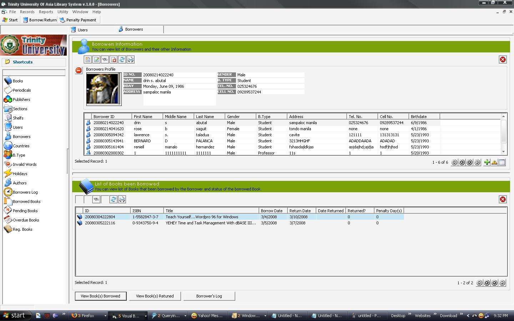



## Library System

### Description

 
### More Info
 
To share my knowledge and to win a price. All VB6 Lovers this is my new 

<A target=_blank HREF="/RentACoder/DotNet/WarningPage.aspx?Source=webpage&ExternalUrl=http%3A%2F%2Fopenmosoftware%2Ewordpress%2Ecom%2Fcategory%2Fmosoftware%2Dvb6%2F">My VB6 BLOG</a> 

Blogs and you're welcome to visit.  

System Features: 

1)BORROWED BOOKS AND RETURN BOOKS 

2)THREE(3) USERS ACCESS LEVEL ADMIN, SEARCH(OPAC),STUDENT LOGS. 

3)STUDENT LOGS USE TO MONITOR STUDENTS WHO ENTERED LIBRARY. 

4)HOLIDAYS MODULE FOR RETURNED BOOKS ADJUSTMENTS. 

5)GENERATE BORROWED RETURNED PRINT RECEIPTS 

6)GENERATE PENALTY PAYMENT RECEIPTS 

Thanks Happy Coding!

 

I'm Happy to help for those have question you can email me at lordstriker24@yahoo.com

             |
---                |---
**Submitted On**   |2008-06-22 23:05:06
**By**             |[mosoftware](https://github.com/Planet-Source-Code/PSCIndex/blob/master/ByAuthor/mosoftware.md)
**Level**          |Intermediate
**User Rating**    |5.0 (15 globes from 3 users)
**Compatibility**  |VB 6\.0
**Category**       |[Complete Applications](https://github.com/Planet-Source-Code/PSCIndex/blob/master/ByCategory/complete-applications__1-27.md)
**World**          |[Visual Basic](https://github.com/Planet-Source-Code/PSCIndex/blob/master/ByWorld/visual-basic.md)
**Archive File**   |[Library\_Sy214274252009\.zip](https://github.com/Planet-Source-Code/mosoftware-library-system__1-71723/archive/master.zip)

